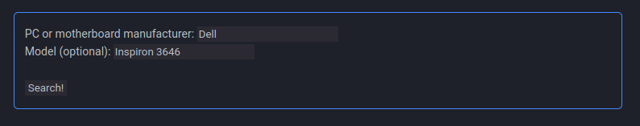

# :material-keyboard: Boot Menu Key

Use the form below to find the correct key to press to access your boot menu. Look for the keys listed for the **Boot Menu**.

!!! note ""

    <form id="form" onsubmit="return false;">
        <label for="form">PC or motherboard manufacturer: </label> <input type="text" id="userInput" />  
        <label for="form">Model (optional): </label> <input type="text" id="input2" />   
        <input type="submit" value="Search!" onclick="gse();" />
    </form>

    
!!! info "Form Example"
    Full PC model name: **Dell Inspiron 3646**

    Do not put the manufacturer's name in the model name.
    