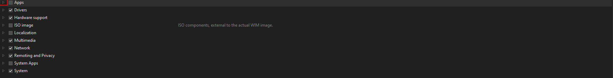
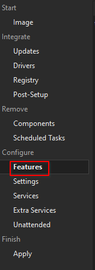

# :material-apps-box: Included Apps

## :material-apps-box: Apps

Head on over to `Components`. You will see a watning. Read it. Once that is done and you understand the risks, cliock the little arrow next to `Apps`.

You can choose what preinstalled apps you would like here, just check or uncheck them.

!!! danger "Do not uncheck any apps that are included by default!"
    Removing these apps will cause incompatibility with playbooks. 
    
    The list of default included apps is as follows (do not remove these):

    - Edge
    - Xbox
    - Defender
    - Microsoft Store and Store Experience Host
    - App Installer
    - Game Bar
    - Anything else that is checked by default that I forgot to put in here.

## :material-package-variant-plus: Windows Features

Head to `Features`.

Here you can enable or disable standard Windows features like Hyper-V, or older versions of .NET.

Once again, **do not touch anything you do not understand.**
