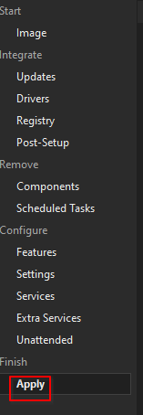
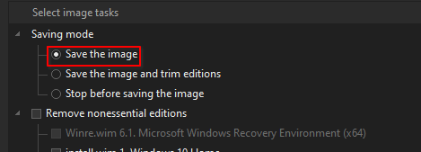
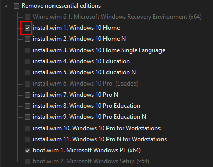

# :octicons-versions-16: Editions

Go to `Apply`.

Change `Saving Mode` to `Save the image`, this will unlock edition settings.

Now, check the editions you want. For example, if you want Windows Home:

!!! warning "Ensure `boot.wim: Microsoft Windows PE` is always checked."

