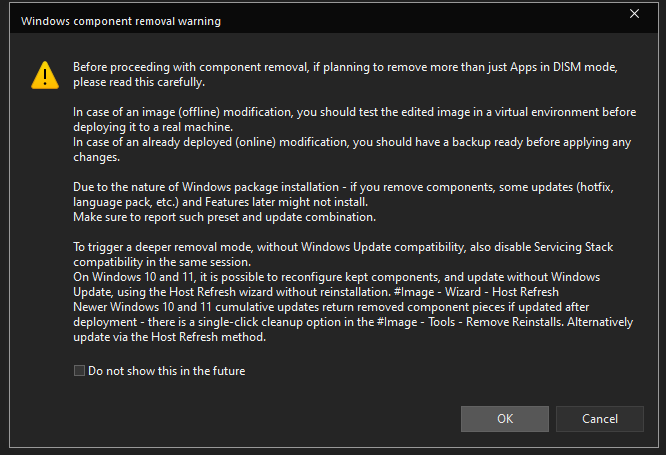

# :material-translate: Languages

??? warning "NTLite DISM Warning"
    

In order to change the avalible languages head to `Components` and find `Localization`, then `Languages`.

Simply check the box of the language you want.

??? note "Enabling IME (Japanese/Chinese Traditional/Korean users)"
    You will need to enable IME for your language as shown below:

    

    According to [Microsoft](https://learn.microsoft.com/en-us/windows/apps/design/input/input-method-editors):
    > An Input Method Editor (IME) is a software component that enables a user to input text in a language that can't be represented easily on a standard QWERTY keyboard. This is typically due to the number of characters in the user's written language, such as the various East Asian languages.

    > Instead of each single character appearing on a single keyboard key, a user types combinations of keys that are interpreted by the IME. The IME generates either the character that matches the set of key strokes or a list of candidate characters to choose from. The selected character is then inserted into the edit control that the user is interacting with.

