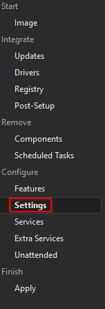

# :material-wrench-cog-outline: Windows Settings

Go to `Settings`.

Here you can search for all kinds of settings and tweak them to your heart's content.

!!! warning "Don't touch anything you don't understand."

