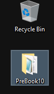
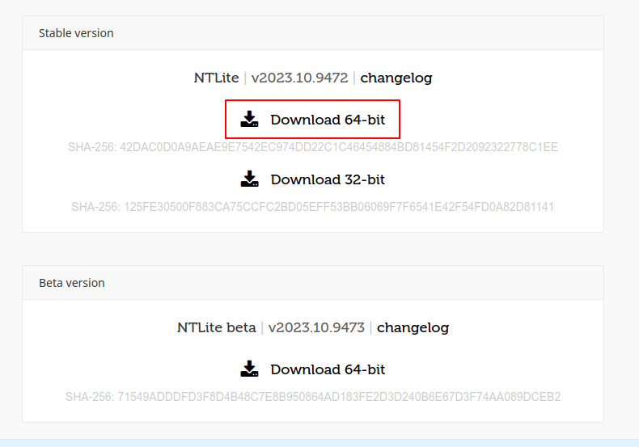

# :material-hammer-wrench: Setup

## :material-clipboard-list: What you'll need

- A Windows ISO
- A Windows PC or VM
- [NTLite](https://ntlite.com) (free edition)
- A USB
- [Rufus](https://rufus.ie "Bootable USB creator for Windows") or [Ventoy](https://www.ventoy.net "Multiple ISOs on one USB stick!")
- Our preset

!!! danger "This section is not finished!"

    Please wait until we finish building it.

## :material-download: Getting our preset

You can download the latest preset release at the links below:

[:material-download: Download PreBook 10](https://github.com/Pre-Book/PreBook/releases/latest/download/PreBook10.zip){ .md-button } [:material-download: Download PreBook 11](https://github.com/Pre-Book/PreBook/releases/latest/download/PreBook11.zip){ .md-button }

You will get a ZIP file containing everything you'll need, which will look something like this:


```js title="PreBookXX.zip"
.
├── registry/
│   └── <.reg files> // (1)!
├── ei.cfg // (2)!
└── PreBookXX.xml // (3)!
```

1.  All the .reg files specific to your version are here.
2.  This file forces the edition picker, more on that later.
3.  The preset itself. Named PreBook10 or PreBook11.

Extract this ZIP file into a new folder called **`PreBook`** somewhere (like your desktop) using your favorite archiving tool (like [7-zip](https://7-zip.org)). Keep it safe for now, we'll need it later.



## :material-disc: Getting an ISO

PreBook is **BYOM**, meaning you need to get your own ISO image of Windows 10 or 11 for your language.

To do this, you can use the downloader below. Simply press one of the download buttons to get started.

!!! warning "UBlock Origin and similar tools"
    One of the scripts used here is blocked by UBlock Origin. 
    
    Some exceptions have been made, we are not one of them. Do not report this to UBlock, [they know](https://github.com/uBlockOrigin/uAssets/issues/16440).

    This was fixed for the AtlasOS docs and MSDL ([:material-github:Atlas docs PR](https://github.com/uBlockOrigin/uAssets/pull/20642)). 
    
    If you have such tools, this downloader will use a proxy. However, to avoid strain on said proxy, we recommend disabling your adblocker on this page temporarily (re-enable it once the download is done).

**Based upon:** [Microsoft Software Download Listing](https://github.com/massgravel/msdl)

**Taken from:** [AtlasOS Docs](https://github.com/Atlas-OS/docs/blob/master/docs/javascripts/msdl.js)


<br><br>

<!--
    This is based upon the Microsoft Software Download Listing website by massgravel on GitHub.
-->
<!--
    The JavaScript file that is used with this is licensed under GNU Affero General Public License v3.0,
    in accordance with the original project. https://github.com/massgravel/msdl/blob/main/LICENSE
-->
<!--
    This was taken from the AtlasOS docs. See the JavaScript: https://raw.githubusercontent.com/Atlas-OS/docs/master/docs/javascripts/msdl.js
-->

<center class="centerMsdl">
<div class="msdl-button-container">
    <button class="msdl-button" style="margin-right: 2px" onclick="getWindows(2860);">Download Windows 11 x64</button>
    <button class="msdl-button" style="margin-left: 2px" onclick="getWindows(2618);">Download Windows 10 x64</button>
</div>

<div id="msdl-ms-content"></div>

<div id="msdl-please-wait">
    <p>Please wait...</p>
</div>

<div id="msdl-processing-error">
    <p>An error has occurred while processing your request.Try refreshing the page or using an alternative method.</p>
    <p id="msdl-error-code">Error: Unknown</p>
</div>

<div id="msdl-download">
    <p>A download should soon be started, if not, <a id="msdl-download-link" href="about:blank">click here to download the ISO</a>.</p>
</div>

<input id="msdl-session-id" type="hidden">
</center>

??? note "Alternatives"
    === "Windows Media Creation Tool"
        !!! failure "Windows 11"
            AME playbooks only support Windows 10 22H2 and Windows 11 23H2.

            The current Media Creation Tool for Windows 11 only creates 22H2 media, so the Windows 11 Media Creation Tool currently can't be used for Prebook.

        1. Download the [Windows 10](https://go.microsoft.com/fwlink/?LinkId=691209) Media Creation Tool and open it.
        2. Click the `Accept` button to agree to the Microsoft license terms.
        3. Tick `Create installation media (USB flash drive, DVD, or ISO file) for another PC`, click `Next`, and choose:
            * Language: **Desired language**
            * Edition: **Windows 10**
            * Architecture: **64-bit (x64)**
        4. Choose the `ISO file` option and choose the download location.
        5. After the ISO has finished downloading, click `Finish` to close the tool.
        *Taken from the AtlasOS Docs. Credit to all AtlasOS contributors.*
    === "MSDL website"
        Visit the [MSDL website](https://massgrave.dev/msdl), and download your Windows ISO from there.

        When choosing the ISO download link at the end, make sure to pick `IsoX64 Download`.

        [:material-microsoft-windows: Download Windows 10](https://massgrave.dev/msdl/#2618){ .md-button }
        [:material-microsoft: Download Windows 11](https://massgrave.dev/msdl/#2860){ .md-button }

## :material-package-variant: Installing NTLite

!!! info "You only need NTLite free!"
    You do not need the paid version of NTLite to use PreBook. However, you should [buy it](https://www.ntlite.com/shop/) to show some :heart: to the developer!

Click the button below and pick `64-bit` under `Stable`:

[](https://www.ntlite.com/download/)


[Download NTLite :material-open-in-new:](https://www.ntlite.com/download/){ .md-button }


Open the installer, and go through the steps.

Once you come here, pick `Free`, then `Close`:


Once NTLite is installed, we can continue with the other steps.

## :material-book-cog: Choose a playbook

This will affect what additional tweaks need to be done.

??? warning "Do not use the Ameliorated playbook!"

    This playbook leaves Windows in a very insecure (and potentially broken) state. 
    We highly recommend against using it.
    
    These playbooks use the AME Wizard, but AME's own playbook for it should be avoided.

[:atlas-atlas: AtlasOS](playbooks/atlas.md){ .md-button } [:revi-revi: ReviOS](playbooks/revi.md){ .md-button } [:material-microsoft-windows:{ .windows } None (stock)](playbooks/stock.md){ .md-button }

-----

*AtlasOS branding copyright &copy; [Jack Holmes](https://jackholmes.zip) & [AtlasOS](https://atlasos.net) 2023.*  

*ReviOS branding copyright &copy; [Revision](https://revi.cc) 2019 - 2023.* 
