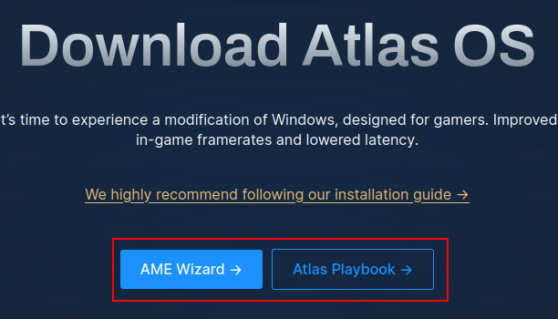

# :material-controller: AtlasOS

!!! danger "This also isn't finished!"
    Please be patient.

## Download AtlasOS

Head on over to the AtlasOS [download page](https://atlasos.net/downloads) and get the two files there.

Extract the AtlasOS ZIP file to the same folder as the preset. Do the same thing for the AME wizard ZIP file.

Your preset folder should look something like this:

<image>

Now, we can actually apply our preset.

## Using NTLite

Assuming you have NTLite installed, simply open it. You'll be shown a confusing window, so just follow this guide step-by-step.

### Loading our ISO image

First, click `Open` on the top, and browse for the Windows ISO you downloaded in the [Setup section](../README.md#obtaining-an-iso).

<image>

This will extract the image into the edit cache.