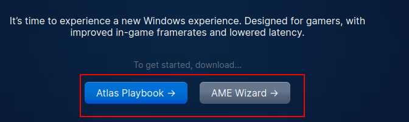
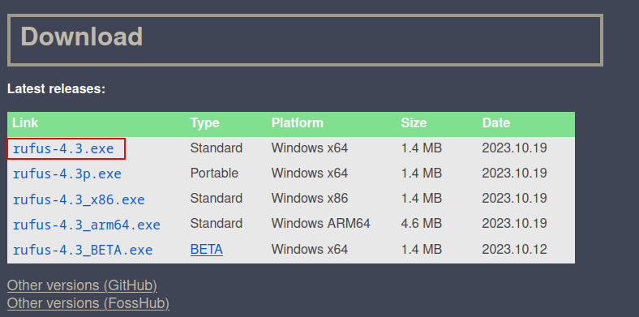
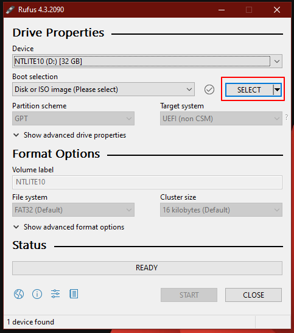
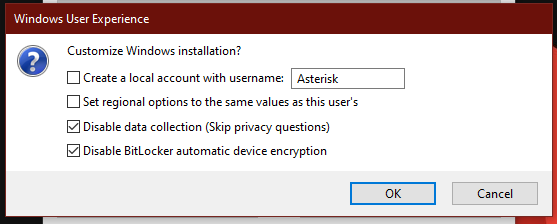
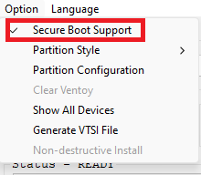

# :atlas-atlas: AtlasOS

!!! warning "The Atlas team will not provide support!"
    The AtlasOS support team will not provide support if you use PreBook with the Atlas playbook, please seek support from us instead.

!!! danger "This also isn't finished!"
    Please be patient.

## :material-download: Download AtlasOS

Head on over to the AtlasOS [download page](https://atlasos.net) and get the two files there.

Extract the AtlasOS ZIP file to the same folder as the preset. Do the same thing for the AME wizard ZIP file.

Your preset folder should look something like this now:

Now, we can actually apply our preset.

## :material-package-variant: Using NTLite

Assuming you have NTLite installed, simply open it. You'll be shown a confusing window, so just follow this guide step-by-step.

### :material-disc: Loading the ISO image

First, click `Add` on the top, then select `Image (ISO, WIM, ESD, SWM)` and browse for the Windows ISO you downloaded in the [:material-hammer-wrench: Setup section](../README.md#obtaining-an-iso).

This will add the image into the image list below. Right click it and choose `New Edit`.

This will extract the image into the edit cache. Press OK at the prompt.

Then, load the `Pro` edition from the edit cache:

### :material-clipboard-text: Loading the preset

Then, import our preset (the `.xml` file)

Now, right click our preset and choose `Load > Overwrite`.

### :material-screwdriver: Applying registry tweaks

Head over to the `Registry` tab.

At the top, click `Add > Registry Files`.

Now, find the `Disable.Drivers.Installation.in.Windows.Update.reg` in the preset folder. Load it. If you want you can also load any aditional tweaks in the `registry/` folder.

The Registry panel should look something like the picture below:

!!! info "Want to change something?"
    Consult the [:material-palette: Customization](../../customization/README.md) section and change anything that you wish to change.

## :material-account-hard-hat: Building our ISO

Head on over to the `Apply` tab and look at the options.

Now, the most important thing here is picking our *compression*.

| Details                                                 |    ESD Compression    |      WIM compresion       |
| :------------------------------------------------------ | :-------------------: | :-----------------------: |
| :material-speedometer: Compression Speed                | :material-close: Slow | :material-check-all: Fast |
| :material-zip-box:                      Final file size |        2-3 GB         |           5 GB            |

Once you've chosen, set your compression below:

=== "ESD"
    
    
=== "WIM"
    
    

Now, just tick the `Create ISO` box.

You'll be asked to pick a location to save and an ISO label.

After you set those options, your process list should look something like this:

Now, hit the big green `Process` button.

This will take a while. After it's done, you will find an ISO file in the folder you set.

This is the ISO we're going to flash to our USB, keep it safe.

## :material-usb-flash-drive: Flashing our ISO to a USB drive

!!! danger "THIS WILL WIPE YOUR CHOSEN USB DEVICE!"
    This will wipe the chosen USB drive and all files. Please be careful.

Plug in your USB, and pick your flashing software of choice below:

=== "Rufus (recommended)"
    Download Rufus from [rufus.ie](https://rufus.ie). Get the normal x64 version, or the ARM64 version if you're currently using ARM64 Windows.

    

    Open `Rufus-<version>.exe` and ensure that the USB drive you plugged in is set at the top.

    Next to **Disc or ISO image** choose `SELECT`.

    

    A file picker will open, select the ISO file you just created.

    All options should be accessible now. Leave all settings as they are. To begin the process, hit `START`.

    You will eventually come to a screen like this:

    

    Select the following patches based on your version. 
    
    !!! warning "Bypassing Windows 11 requirements"
        It's not recommended to bypass Windows 11's requirements as anticheats will still check if you meet them regardless.
        
    **:material-microsoft-windows: Windows 10:**

    - Disable data collection
    - Disable automatic BitLocker device encryption
    
    **:material-microsoft: Windows 11:** 

    - Bypass requirements (Optional, not recommended)
    - Bypass online Microsoft account requirement
    - Disable data collection
    - Disable automatic BitLocker device encryption

    Then, press `OK` (and `OK` again at the warning) and wait for the flashing process to complete. Once it completes, you can close the program.

=== "Ventoy"
    First, download Ventoy from [ventoy.net](https://ventoy.net/download.html) and extract it somewhere. In the Ventoy folder, run `Ventoy2Disk.exe`.

    In `Ventoy2Disk`, select your USB drive, then at the top, click `Option` and enable `Secure Boot Support`.

    

    Click `Install`.

    Once it's done copy (drag and drop) your fresh PreBook ISO to the root of the drive labelled `Ventoy`.

Now that the flashing process is complete, take your **`PreBook`** folder and copy it to your USB drive (drag and drop).

## :material-power: Boot off of our USB

=== "Method 1: Windows Boot Settings"
    !!! info "This method only works on Windows."
    1. Open the `Run` dialog by pressing ++win+r++
    2. Type `shutdown /r /t 1 /o` and press ++enter++
    3. Your computer will reboot into a screen that says **Choose an Option**.
    4. Click **Use a Device**.
    5. Click on the name of your USB drive or **EFI USB Device**.
=== "Method 2: One-time boot menu"
    !!! info "This method works on any Windows (even custom) or Linux PC."
    1. Find your boot settings key. This can be found through a simple [search](../../boot-key.md) or via your PC or motherboard's manual.
    2. Spam this key while turning on your PC and having the USB plugged in.
    3. You should see a device list, pick your USB device.

Wait for the Windows installer to load.
